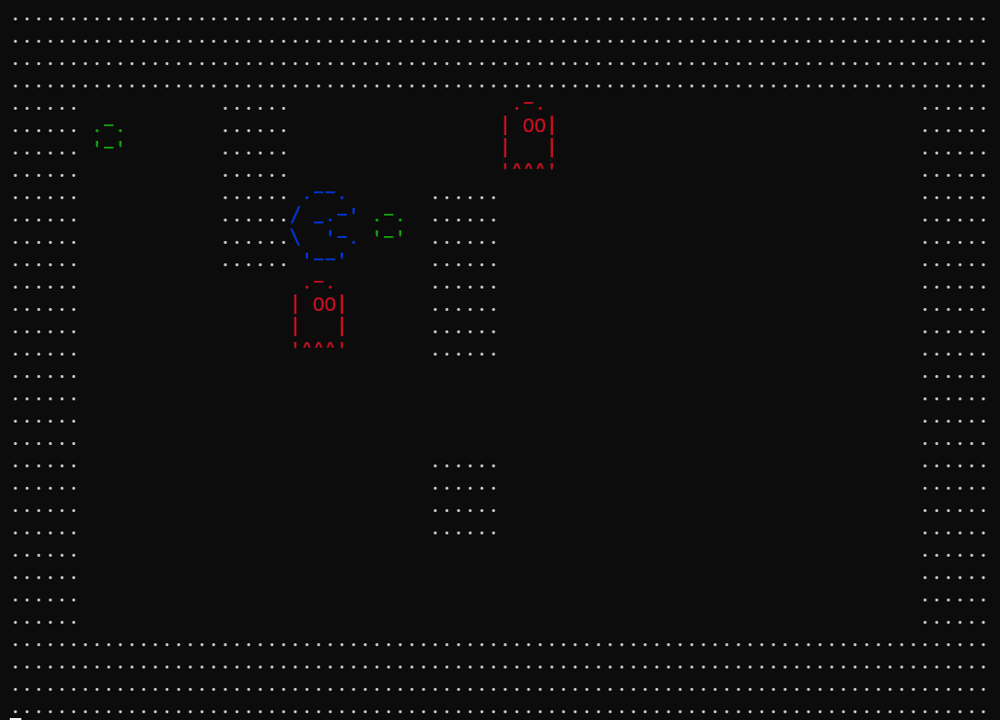

# foge-foge
it's a game full developed in C  
you just have to get the bombs and explode the ghosts  
it's very similar to PAC-MAN but it's really different at the same time  
the most code it's inspired in @Alura course
 
## how to play
to move is used WASD and to active the power is B.

## language & tools
  

## images <:

